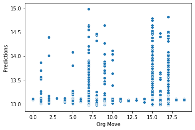
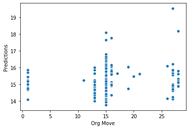

# ChessBoto
***This is a chess bot for cmpsc 445***

Abstract:  Using SVM’s, Neural Networks, and Bayesian Classifiers we are planning to code a chess AI to help out new players who are trying to win.

Goal: Our goal is to create Chess Assistant AI, given a sequence of moves by White and Black predicts the best move for the current player. And to figure it out who will be the winner.

Objectives: To get a better idea of Chess Assistant features using machine learning. 
 Create a working chess AI.

Class/Block Diagram:

Contribution Plan: First week will be spent implementing Phases 1 and 1.5, second week will be getting the general format of the ANN, third week will be spent tuning the activation functions and creating the chess AI (teaching it abstract concepts such as space, position and material), fourth week will be playtesting the AI and building the report.

Now lets run through a move prediction of whites second move.

The first move will be white to e4 and the second will be black to d5.

Here is an example run through for our project. We are going to enter 'e4' as our move. Then our project will run through the 10000 cases we set from the test data, test, train, and then are plotted on the scatter plot to show a result like this:

From this image we see there are quite a few moves becasue a lot of the test pool resonates in the beginning few moves. So by inputing the next move by 'd5' we now get a new chart to see what whites move will be when predicted. We got: 

From this image we can see the predicted moves are very narrow, only a handful, when compaired to the first. Our possible moves include 'Nc3', 'Na3','exd5', 'e5', 'h3', 'g3' with the most common being 'exd5'

