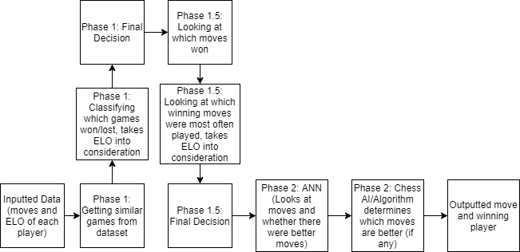

# ChessBoto
***This is a chess bot for cmpsc 445***

Abstract:  Using SVM’s, Neural Networks, and Bayesian Classifiers we are planning to code a chess AI to help out new players who are trying to win.

Goal: Our goal is to create Chess Assistant AI, given a sequence of moves by White and Black predicts the best move for the current player. And to figure it out who will be the winner.

Objectives: To get a better idea of Chess Assistant features using machine learning. 
 Create a working chess AI.

Class/Block Diagram:

Contribution Plan: First week will be spent implementing Phases 1 and 1.5, second week will be getting the general format of the ANN, third week will be spent tuning the activation functions and creating the chess AI (teaching it abstract concepts such as space, position and material), fourth week will be playtesting the AI and building the report.

